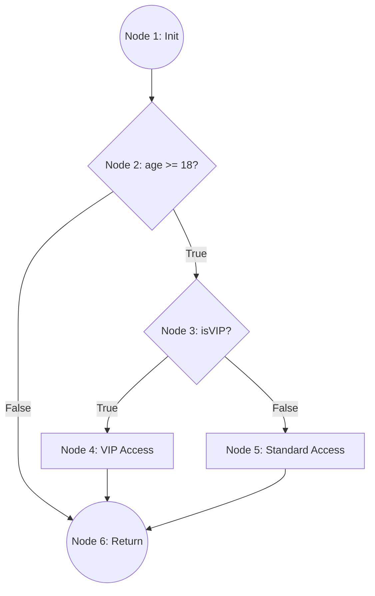

# 📚 Software Engineering (SE) Finals: Master Exam Notes
## 📦 Batch 5: Software Verification & Testing Design
> **Lectures Covered:** Lectures 17, 18, and 19 (Software Testing, White-Box Testing, and Decision Tables)
> **Goal:** Flawless ECP/BVA test design, precise Control Flow Graph (CFG) generation, 3-way Cyclomatic Complexity calculations, and bulletproof Decision Table reduction.

---

## 🎯 1. Testing Foundations (Lecture 17)

### A. Software Faults, Errors, and Failures
Software does not fail due to physical wear and tear. It fails due to design or translation errors:
* **Fault (Defect/Bug):** An incorrect step, process, or data definition in a software system (the static problem in the code).
* **Error:** A human mistake made by a software engineer (e.g., writing a `<` instead of a `<=`), which results in a Fault.
* **Failure:** An event where the software behaves in an unexpected, incorrect manner under execution (the dynamic symptom observed by the user).
> [!NOTE]
> **Testing vs. Debugging:** 
> * **Testing:** The systematic process of executing software with the intent of *finding failures*.
> * **Debugging:** The diagnostic process of locating and *fixing the underlying fault* once a failure has been discovered.


---


---

### B. The 7 Elements of a Professional Test Case
A test case is a documented set of inputs, execution conditions, and expected results developed for a particular objective. In exams, you must draw this exact table template:

| Element | Description | Example |
| :--- | :--- | :--- |
| **1. Test Case ID** | A unique identifier for traceability. | `TC_AUTH_01` |
| **2. Description** | The specific objective or feature being tested. | Verify login fails with incorrect password. |
| **3. Preconditions** | The system state required before execution. | User account exists; user is on login page. |
| **4. Test Inputs** | The exact data values supplied to the system. | Username: `test@user.com`, Password: `wrongPass123` |
| **5. Expected Output** | The precise system behavior expected. | Display error message: *"Invalid password entered."* |
| **6. Actual Output** | The actual behavior observed (left blank during design). | Displayed error message. |
| **7. Status** | Pass / Fail (evaluated post-execution). | Pass |

---

### C. Failure Severity Levels (Impact Grading)
1. **Catastrophic (Severity 1):** Causes system crash, database corruption, or complete loss of critical services. No workaround exists.
2. **Major (Severity 2):** Causes a core functional failure. A manual workaround exists, but it is highly inconvenient.
3. **Moderate (Severity 3):** Affects non-critical functions or cosmetic elements. System remains fully operational.

---

## 🖤 2. Black Box Testing: ECP & BVA (Lecture 17)
Black box testing (Functional testing) treats the system as a "black box" — inputs are supplied, and outputs are verified against requirements, without any knowledge of internal code paths.


### A. Equivalence Class Partitioning (ECP)
* **Philosophy:** Divide the input domain of a program into classes of data from which test cases can be derived.
* **Assumption:** If one test case in a partition passes, all other test cases in that partition will also pass. (Reduces total test count).
* **Partition Types:**
  - **Valid Partitions:** Inputs that are correct and expected.
  - **Invalid Partitions:** Inputs that are incorrect, out of bounds, or unexpected (to test system resilience).

---

### B. Boundary Value Analysis (BVA)
* **Philosophy:** Errors occur most frequently at the boundaries of input domains, rather than in the center. BVA tests the exact edges.
* **The Rule of Boundaries:** For any input range $[Min, Max]$:
  - Test exactly at the boundaries: $Min$ and $Max$.
  - Test just below the boundaries: $Min - 1$ and $Max - 1$.
  - Test just above the boundaries: $Min + 1$ and $Max + 1$.

---

## 🤍 3. White Box Testing & Cyclomatic Complexity (Lecture 18)
White box testing (Structural testing) designs test cases based on explicit knowledge of the internal code structures, paths, and control logic.

### A. Whitebox Test Thoroughness (Lecture 18)
Test thoroughness measures how completely your test suite exercises the internal code structure. It is organized into a hierarchy of coverage metrics:

1. **Statement Coverage (Weakest Thoroughness):** 
   * **Goal:** Execute every single line (statement) of code at least once.
   * *Problem:* A test suite might achieve 100% statement coverage but completely miss hidden logical flaws in `else` branches that contain no code.
2. **Branch / Decision Coverage (Moderate Thoroughness):**
   * **Goal:** Execute every possible branch of every decision node (both the True and the False pathways) at least once.
   * *Improvement over Statement:* Ensures that both outcomes of an `if` statement are tested, even if one branch is empty.
3. **Path Coverage (Strongest Thoroughness):**
   * **Goal:** Execute all possible independent execution pathways through the code from start to finish.
   * *Note:* This is the most thorough and rigorous whitebox testing method. The number of paths is equal to the Cyclomatic Complexity $V(G)$.

---

### B. Control Flow Graph (CFG) Node Mapping Cheat Sheet
To draw a correct CFG on paper, map these standard programming statements to nodes and edges:

| Statement Type | Visual CFG Mapping | Slide / Standard Form |
| :--- | :--- | :--- |
| **Sequence** | Nodes connected in a straight line. |  |
| **If-Then-Else** | One node branching into two paths, merging back at a join node. |  |
| **While Loop** | A decision node pointing to the body, looping back to the decision, with an exit branch. |  |
| **Do-While** | The loop body executes first, leading to a decision node that loops back to the start. |  |

---

### C. Comprehensive CFG & Cyclomatic Complexity Case Study
Let's analyze a sample system function, assign nodes, draw its Control Flow Graph, and calculate its Cyclomatic Complexity using **all three mathematical formulas**.

#### **1. The Target Code (VIP User Verification):**
```javascript
1: function verifyUser(age, isVIP) {
2:     let status = "Denied";
3:     if (age >= 18) {
4:         if (isVIP == true) {
5:             status = "VIP Access Granted";
6:         } else {
7:             status = "Standard Access Granted";
8:         }
9:     }
10:    return status;
11: }
```

#### **2. CFG Node Assignment Mapping:**
* **Node 1:** Lines 1-2 (Initialization).
* **Node 2:** Line 3 (Decision: `age >= 18`).
* **Node 3:** Line 4 (Decision: `isVIP == true`).
* **Node 4:** Line 5 (Assign `VIP Access`).
* **Node 5:** Line 7 (Assign `Standard Access`).
* **Node 6:** Line 10-11 (Return status).

---

#### **3. Control Flow Graph Diagram (Mermaid JS):**



---

#### **4. Three-Way Cyclomatic Complexity Calculation Verification:**
To guarantee a 100% score on the exam, calculate $V(G)$ using all three distinct formulas:

* **Formula 1: Edges and Nodes ($V(G) = E - N + 2$)**
  - Count of Nodes ($N$) = 6 (Nodes 1, 2, 3, 4, 5, 6)
  - Count of Edges ($E$) = 7 (Connections: 1$\rightarrow$2, 2$\rightarrow$3, 2$\rightarrow$6, 3$\rightarrow$4, 3$\rightarrow$5, 4$\rightarrow$6, 5$\rightarrow$6)
  - Calculation:
    $$V(G) = 7 - 6 + 2 = 3$$

* **Formula 2: Predicate/Decision Nodes ($V(G) = P + 1$)**
  - Count of Predicate Nodes ($P$) = 2 (Node 2 and Node 3 are the decision diamonds)
  - Calculation:
    $$V(G) = 2 + 1 = 3$$

* **Formula 3: Closed Regions ($V(G) = R$)**
  - Look at the graph:
    - **Region 1:** The closed region formed by 2 $\rightarrow$ 3 $\rightarrow$ 4 $\rightarrow$ 6 $\rightarrow$ 2.
    - **Region 2:** The closed region formed by 2 $\rightarrow$ 3 $\rightarrow$ 5 $\rightarrow$ 6 $\rightarrow$ 2.
    - **Region 3:** The infinite outer region surrounding the graph.
  - Calculation:
    $$V(G) = \text{Regions} = 3$$

> [!TIP]
> **Self-Check Passed:** Since all three formulas yield exactly **3**, the drawn graph and calculation are mathematically verified.

---

#### **5. The Independent Basis Paths:**
A complexity of 3 dictates that there are exactly **3 independent paths** through this code:
* **Path 1:** $1 \rightarrow 2 \rightarrow 6$ (Underage user).
* **Path 2:** $1 \rightarrow 2 \rightarrow 3 \rightarrow 4 \rightarrow 6$ (Adult VIP user).
* **Path 3:** $1 \rightarrow 2 \rightarrow 3 \rightarrow 5 \rightarrow 6$ (Adult standard user).

---

## 📋 4. Decision Table Testing & Reduction (Lecture 19)

### A. Core Elements of a Decision Table
A Decision Table (Cause-Effect table) systematically maps combinations of input conditions (causes) to system actions (effects).
* **Condition Stub:** The list of input variables or logical state statements (rows).
* **Action Stub:** The list of potential system outputs or operations (rows).
* **Rules:** The columns representing specific combinations of condition states (True/False or Yes/No) and their corresponding action selections.

---

### B. The Mathematical Decision Table Reduction Rules
A full decision table for $N$ binary conditions has exactly $2^N$ rules. Many of these rules are redundant because a specific condition's state does not alter the resulting actions.

#### **The Reduction Principle:**
If two rules have **identical actions**, and their condition values are identical for all conditions except *one*, that single condition is a **"Don't Care"** state (represented as a dash **$-$**). You can merge these two rules into a single rule column, dividing the total test scenarios.

---

### C. Solved Case Study 1: Login Screen (Slide 5-6)
A dialogue box prompts for a Username and Password.
* **Conditions:**
  - $C_1$: Correct Username (T/F)
  - $C_2$: Correct Password (T/F)
* **Actions:**
  - $A_1$: Show Error Message (E)
  - $A_2$: Open Home Screen (H)

#### **1. Full Decision Table:**

| Conditions | Rule 1 | Rule 2 | Rule 3 | Rule 4 |
| :--- | :---: | :---: | :---: | :---: |
| **$C_1$: Correct Username?** | T | T | F | F |
| **$C_2$: Correct Password?** | T | F | T | F |
| **Actions:** | | | | |
| **$A_1$: Show Error Message (E)** | | X | X | X |
| **$A_2$: Open Home Screen (H)** | X | | | |

* **Slide Reference Image:**


---


---

### D. Solved Case Study 2: Photo Upload Screen (Slide 7-10)
A dialogue box asks users to upload a photo under three strict conditions:
1. Format must be `.jpg`.
2. File size must be less than 32KB.
3. Resolution must be exactly $137 \times 177$.

#### **1. Full Decision Table ($2^3 = 8$ Rules):**

| Conditions | R1 | R2 | R3 | R4 | R5 | R6 | R7 | R8 |
| :--- | :---: | :---: | :---: | :---: | :---: | :---: | :---: | :---: |
| **Format is `.jpg`?** | Y | Y | Y | Y | N | N | N | N |
| **Size < 32KB?** | Y | Y | N | N | Y | Y | N | N |
| **Resolution $137 \times 177$?** | Y | N | Y | N | Y | N | Y | N |
| **Actions:** | | | | | | | | |
| **Accept Upload?** | X | | | | | | | |
| **Reject & Show Error?** | | X | X | X | X | X | X | X |

* **Slide Reference Image:**


---

### E. Solved Case Study 3: Consultant & Permanent Payment System (Slide 11-16)
> **Payment Rules:**
> 1. Consultants working $> 40$ hours/week are paid standard hourly rate for the first 40 hours, and $2\times$ hourly rate for subsequent hours.
> 2. Consultants working $< 40$ hours/week are paid standard hourly rate, and an absence report is produced.
> 3. Permanent workers working $< 40$ hours/week are paid their standard salary, and an absence report is produced.
> 4. Permanent workers working $\ge 40$ hours/week are paid standard salary.

#### **1. Cause and Effects Mapping:**
* **Conditions:**
  - $C_1$: Permanent Worker? (Y/N)
  - $C_2$: Worked $<40$ hours? (Y/N)
  - $C_3$: Worked exactly $40$ hours? (Y/N)
  - $C_4$: Worked $>40$ hours? (Y/N)
* **Actions:**
  - $E_1$: Pay Salary
  - $E_2$: Produce Absence Report
  - $E_3$: Pay Hourly Rate
  - $E_4$: Pay $2\times$ Hourly Rate

#### **2. Full Decision Table:**


#### **3. Reduced Decision Table (Slide 15):**
By applying the reduction principle, we combine redundant columns:
* For Permanent Workers, if they work $\ge 40$ hours, they get paid standard salary. The sub-conditions "$=40$" and "$>40$" have identical effects, so they merge.

| Conditions | Rule 1 | Rule 2 | Rule 3 | Rule 4 | Rule 5 |
| :--- | :---: | :---: | :---: | :---: | :---: |
| **$C_1$: Permanent Worker?** | Y | Y | N | N | N |
| **$C_2$: Worked $< 40$ hours?** | Y | N | Y | N | N |
| **$C_3$: Worked exactly $40$ hours?** | N | $-$ | N | Y | N |
| **$C_4$: Worked $> 40$ hours?** | N | $-$ | Y | N | Y |
| **Actions:** | | | | | |
| **$E_1$: Pay Salary** | X | X | | | |
| **$E_2$: Produce Absence Report** | X | | X | | |
| **$E_3$: Pay Hourly Rate** | | | X | X | X |
| **$E_4$: Pay $2\times$ Hourly Rate** | | | | | X |

* **Slide Reference Image:**


---

## 💡 5. Scenario-Based Testing Design Playground

---

### 🏛️ Challenge 1: ECP and BVA Test Design for Age Input
> **Scenario:** An online driver's license application portal allows users to register. The system requires users to enter their age. The age input field accepts positive integers between **18** and **75** (inclusive).
> 
> **To do:** Design a complete Black Box Test Suite. Identify the Equivalence Partitions and construct a Boundary Value Analysis table.

#### **Solved Solution:**

#### **1. Equivalence Partitioning (ECP):**
* **Partition 1 (Invalid):** Age $< 18$ (Underage - Rejected).
* **Partition 2 (Valid):** $18 \le \text{Age} \le 75$ (Valid - Accepted).
* **Partition 3 (Invalid):** Age $> 75$ (Overage - Rejected).
* **Partition 4 (Invalid):** Non-integer or negative inputs (alphabets, floats - Rejected).

#### **2. Boundary Value Analysis (BVA):**
For boundaries $Min = 18$ and $Max = 75$, our BVA test suite targets:

| Boundary Point | Value | Expected Outcome | Partition Checked |
| :---: | :---: | :--- | :--- |
| $Min - 1$ | 17 | Fail / Show Error | Invalid Partition 1 |
| $Min$ | 18 | Pass / Accept | Boundary Edge (Valid) |
| $Min + 1$ | 19 | Pass / Accept | Inside Valid Partition 2 |
| $Max - 1$ | 74 | Pass / Accept | Inside Valid Partition 2 |
| $Max$ | 75 | Pass / Accept | Boundary Edge (Valid) |
| $Max + 1$ | 76 | Fail / Show Error | Invalid Partition 3 |

---

### 🏛️ Challenge 2: Decision Table Design & Reduction Exercise
> **Scenario:** An e-commerce system offers a checkout discount based on these criteria:
> * If a customer is a Premium Member, they get a 10% discount.
> * If a customer has a valid Coupon Code, they get a 15% discount.
> * If a customer is BOTH a Premium Member and has a Coupon Code, they get a consolidated 25% discount.
> * Non-members without coupons receive no discount.
> 
> **To do:** Draw the complete Decision Table, and state whether it can be reduced.

#### **Solved Solution:**

* **Conditions:**
  - $C_1$: Premium Member? (Y/N)
  - $C_2$: Valid Coupon Code? (Y/N)
* **Actions:**
  - $A_1$: Apply 25% Discount
  - $A_2$: Apply 15% Discount
  - $A_3$: Apply 10% Discount
  - $A_4$: Apply No Discount

#### **The Decision Table:**

| Conditions | Rule 1 | Rule 2 | Rule 3 | Rule 4 |
| :--- | :---: | :---: | :---: | :---: |
| **$C_1$: Premium Member?** | Y | Y | N | N |
| **$C_2$: Valid Coupon Code?** | Y | N | Y | N |
| **Actions:** | | | | |
| **$A_1$: Apply 25% Discount** | X | | | |
| **$A_2$: Apply 15% Discount** | | | X | |
| **$A_3$: Apply 10% Discount** | | X | | |
| **$A_4$: Apply No Discount** | | | | X |

#### **Reduction Evaluation:**
* **Can this table be reduced?** **No**. 
* *Why:* Each rule produces a completely unique, distinct action outcome ($25\%$, $10\%$, $15\%$, and $0\%$). Since no two columns share identical actions, no rules can be mathematically combined. The table is already in its minimal state.
